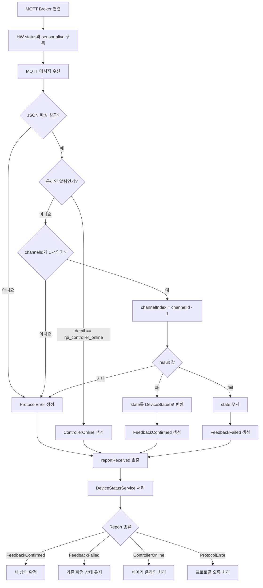

> Updated four-channel MQTT/TopView/event integration: see [MQTT_INTEGRATION.md](MQTT_INTEGRATION.md).

## MQTT 장비 상태 연동 가이드

현재 프로젝트는 `MqttDeviceStatusGateway`를 통해 MQTT/TLS 장비 상태와 센서 health를 전달합니다.

`DemoDeviceStatusGateway`는 개발용 예제로 유지되며, 실행 시에는 `MqttDeviceStatusGatewayFactory`가 사용됩니다.

### 현재 구독 토픽

| 토픽 | 용도 | 채널 규칙 |
| --- | --- | --- |
| `veda/hw/+/status` | `mqtt_tls_hw_controller_async`의 HW 동작 결과 | `channelId` 1~4를 Qt 0~3으로 변환 |
| `veda/hw/status` | `mqtt_tls_broker_server`의 HW 동작 결과 | `channelId` 1~4를 Qt 0~3으로 변환 |
| `veda/ch/+/alive` | `MqttTopViewSink`의 retained LWT health | 토픽 채널 0~3을 그대로 사용 |

Qt 화면은 채널별 `HEALTH ONLINE/OFFLINE/UNKNOWN`과 LED, 사이렌, 부저의 마지막 확인 동작 상태를 표시합니다.

### 실행 환경 변수

| 환경 변수 | 기본값 |
| --- | --- |
| `VEDA_MQTT_HOST` | `100.73.128.114` |
| `VEDA_MQTT_PORT` | `8883` |
| `VEDA_MQTT_CA_FILE` | `/etc/veda/certs/ca.crt` |
| `VEDA_MQTT_CLIENT_ID` | 실행마다 생성되는 `qt-device-status-...` |

TLS 인증서 검증은 비활성화하지 않습니다. Windows에서 실행할 때는 `VEDA_MQTT_CA_FILE`을 실제 CA 인증서 경로로 지정해야 합니다.

---

## 1. MQTT 연동 사양

| 항목 | 값 |
| --- | --- |
| 구독 Topic | `veda/hw/+/status`, `veda/hw/status`, `veda/ch/+/alive`, `veda/ch/+/topview`, `veda/qt/ch/+/topview`, `veda/qt/event` |
| QoS | `1` |
| Publish | 사용하지 않음 |
| Retain 메시지 | `veda/ch/+/alive` health에 적용 |
| HW 채널 ID | 컨트롤러와 중앙 브로커 모두 1~4 |
| 센서 채널 ID | LWT 토픽의 0~3 |
| MQTT 수신 처리 | `DeviceStatusGateway` 전용 스레드 |

### 채널 변환

`veda/hw/+/status` 컨트롤러 상태만 1-based 채널을 변환합니다.

```cpp
const int channelIndex = channelId - 1;
```

예시:

| MQTT `channelId` | Qt `channelIndex` |
| ---------------: | ----------------: |
|                1 |                 0 |
|                2 |                 1 |
|                3 |                 2 |
|                4 |                 3 |

`veda/hw/status`도 1-based `channelId`를 Qt 0-based 인덱스로 변환합니다. `veda/ch/+/alive`와 TopView의 토픽 채널만 0-based 값을 그대로 사용합니다. 각 토픽 규칙의 범위를 벗어나면 프로토콜 오류로 처리합니다.

---

## 2. 필수 확인 파일

### `DeviceStatusGateway`

[`include/network/DeviceStatusGateway.h`](C:/Qtprojects/Qtcctvclient/include/network/DeviceStatusGateway.h#L7)

실제 MQTT Gateway가 구현해야 하는 인터페이스입니다.

주요 항목:

```cpp
start();
stop();
reportReceived(...);
brokerConnectionChanged(...);
```

* `start()`: MQTT Broker 연결 및 Topic 구독 시작
* `stop()`: 구독 해제 및 Broker 연결 종료
* `reportReceived(...)`: 파싱 완료된 장비 상태 전달
* `brokerConnectionChanged(...)`: Broker 연결 상태 변경 전달

`MqttDeviceStatusGateway`는 반드시 이 인터페이스를 구현해야 합니다.

---

### `DeviceStatusReport`

[`include/model/DeviceStatusReport.h`](C:/Qtprojects/Qtcctvclient/include/model/DeviceStatusReport.h#L8)

MQTT JSON Payload를 파싱한 후 변환해야 하는 프로젝트 내부 데이터 형식입니다.

주요 상태:

| 내부 상태               | 의미                 |
| ------------------- | ------------------ |
| `ControllerOnline`  | 제어기 온라인 알림         |
| `SensorOnline`      | 센서 LWT online        |
| `SensorOffline`     | 센서 LWT offline       |
| `FeedbackConfirmed` | 장비 제어 결과 정상 확인     |
| `FeedbackFailed`    | 장비 제어 결과 실패        |
| `ProtocolError`     | JSON 또는 프로토콜 형식 오류 |

MQTT 수신부에서 JSON 원문을 직접 서비스 계층으로 전달하면 안 됩니다.
반드시 `DeviceStatusReport`로 변환한 뒤 `reportReceived(...)`를 통해 전달해야 합니다.

---

### `DeviceStatus`

[`include/model/DeviceStatus.h`](C:/Qtprojects/Qtcctvclient/include/model/DeviceStatus.h#L13)

MQTT JSON의 `state` 필드를 매핑하는 내부 장비 상태 구조입니다.

| MQTT JSON 필드 | Qt 내부 필드    |
| ------------ | ----------- |
| `ledRed`     | `ledRed`    |
| `ledYellow`  | `ledYellow` |
| `ledGreen`   | `ledGreen`  |
| `siren`      | `beacon`    |
| `buzzer`     | `buzzer`    |

주의:

```text
MQTT의 siren 필드는 코드 내부에서 beacon으로 사용합니다.
```

이름이 다르므로 단순 자동 매핑에 의존하지 말고 명시적으로 변환해야 합니다.

---

### `DemoDeviceStatusGateway`

[`src/network/DemoDeviceStatusGateway.cpp`](C:/Qtprojects/Qtcctvclient/src/network/DemoDeviceStatusGateway.cpp#L1)

개발과 UI 확인에 사용할 수 있는 가상 장비 상태 구현입니다. 실제 실행 경로에는 다음 MQTT Gateway가 연결되어 있습니다.

```text
include/network/MqttDeviceStatusGateway.h
src/network/MqttDeviceStatusGateway.cpp
```

Factory는 다음 파일에 구현되어 있습니다.

```text
include/network/MqttDeviceStatusGatewayFactory.h
src/network/MqttDeviceStatusGatewayFactory.cpp
```

`DemoDeviceStatusGateway`와 실제 MQTT Gateway는 동일한 `DeviceStatusGateway` 인터페이스를 구현해야 합니다.

---

### `DeviceStatusService`

[`src/network/DeviceStatusService.cpp`](C:/Qtprojects/Qtcctvclient/src/network/DeviceStatusService.cpp#L122)

Gateway에서 전달된 상태 보고서를 실제 UI 상태에 반영하는 처리 규칙이 구현되어 있습니다.

MQTT 담당자가 반드시 지켜야 하는 규칙은 다음과 같습니다.

#### `result == "ok"`

```text
state를 정상 확정 상태로 적용합니다.
```

변환 결과:

```cpp
DeviceStatusReport::FeedbackConfirmed
```

이 경우에만 Payload의 `state`를 실제 장비 상태로 확정합니다.

#### `result == "fail"`

```text
기존에 확정된 장비 상태를 유지합니다.
```

변환 결과:

```cpp
DeviceStatusReport::FeedbackFailed
```

중요:

```text
실패 Payload에 state 필드가 포함되어 있어도 적용하면 안 됩니다.
```

실패 응답의 `state`를 적용하면 UI가 실제 확정되지 않은 상태로 변경될 수 있습니다.

#### 온라인 알림

```text
detail == "rpi_controller_online"
```

변환 결과:

```cpp
DeviceStatusReport::ControllerOnline
```

온라인 알림은 일반 장비 피드백과 구분해서 처리해야 합니다.

---

### `main.cpp`

[`src/main.cpp`](C:/Qtprojects/Qtcctvclient/src/main.cpp#L55)

현재는 다음 Factory를 생성합니다.

```cpp
MqttDeviceStatusGatewayFactory
```

서비스 계층과 UI 계층은 `DeviceStatusGateway` 인터페이스만 사용하므로, 정상적으로 구현했다면 `main.cpp`의 Factory 생성 부분만 변경하면 됩니다.

---

### `CMakeLists.txt`

[`CMakeLists.txt`](C:/Qtprojects/Qtcctvclient/CMakeLists.txt#L1)

다음 항목이 빌드 대상에 추가되어 있습니다.

* MQTT 라이브러리
* `MqttDeviceStatusGateway.h`
* `MqttDeviceStatusGateway.cpp`
* MQTT Gateway Factory 파일
* 필요한 Qt MQTT 모듈 또는 외부 MQTT 라이브러리

Qt MQTT 모듈 연결은 다음과 같습니다.

```cmake
find_package(Qt6 REQUIRED COMPONENTS Core Mqtt)

target_link_libraries(Qtcctvclient
    PRIVATE
        Qt6::Core
        Qt6::Mqtt
)
```

Gateway 소스 파일도 `Qtcctvclient` 대상에 포함되어 있습니다.

```cmake
target_sources(Qtcctvclient
    PRIVATE
        include/network/MqttDeviceStatusGateway.h
        src/network/MqttDeviceStatusGateway.cpp
        include/network/MqttDeviceStatusGatewayFactory.h
        src/network/MqttDeviceStatusGatewayFactory.cpp
)
```

실제 `target` 이름과 기존 CMake 구조에 맞게 수정해야 합니다.

---

## 3. MQTT 메시지 변환 규칙

### 정상 피드백

조건:

```json
{
  "result": "ok"
}
```

처리:

1. `channelId` 범위를 확인합니다.
2. `channelIndex = channelId - 1`로 변환합니다.
3. `state` 필드를 `DeviceStatus`로 변환합니다.
4. Report 종류를 `FeedbackConfirmed`로 설정합니다.
5. `reportReceived(...)`를 발생시킵니다.

```text
result == "ok"
    → FeedbackConfirmed
    → state 적용
```

---

### 실패 피드백

조건:

```json
{
  "result": "fail"
}
```

처리:

1. `channelId` 범위를 확인합니다.
2. Report 종류를 `FeedbackFailed`로 설정합니다.
3. 실패 사유가 있다면 상세 정보로 저장합니다.
4. Payload의 `state`는 무시합니다.
5. `reportReceived(...)`를 발생시킵니다.

```text
result == "fail"
    → FeedbackFailed
    → 기존 확정 상태 유지
    → Payload state 적용 금지
```

---

### 제어기 온라인 알림

조건:

```json
{
  "detail": "rpi_controller_online"
}
```

처리:

```text
detail == "rpi_controller_online"
    → ControllerOnline
```

일반 장비 상태 피드백과 분리해서 변환합니다.

---

### 프로토콜 오류

다음과 같은 경우 `ProtocolError`로 처리해야 합니다.

* JSON 파싱 실패
* 필수 필드 누락
* 알 수 없는 `result` 값
* `channelId` 범위 오류
* `state` 필드 형식 오류
* 장비 상태 값의 자료형 오류
* 지원하지 않는 메시지 형식

```text
잘못된 Payload를 임의의 기본값으로 보정해서 적용하면 안 됩니다.
```

데이터가 불완전하거나 잘못된 경우에는 상태를 추측하지 말고 오류로 전달해야 합니다.

---

## 4. 상태 처리 흐름



---

## 5. 스레드 처리 주의사항

MQTT 수신부는 별도 스레드에서 동작합니다.

따라서 MQTT 콜백에서 UI 객체를 직접 수정하면 안 됩니다.

권장 흐름:

```text
MQTT Thread
    → JSON 파싱
    → DeviceStatusReport 생성
    → reportReceived Signal 발생
    → Qt Queued Connection
    → DeviceStatusService에서 처리
    → UI 갱신
```

`reportReceived(...)`가 다른 스레드에서 발생할 수 있으므로, 연결 방식과 수신 객체의 스레드 소속을 확인해야 합니다.

필요한 경우 명시적으로 `Qt::QueuedConnection`을 사용합니다.

```cpp
connect(
    gateway,
    &DeviceStatusGateway::reportReceived,
    service,
    &DeviceStatusService::handleReport,
    Qt::QueuedConnection
);
```

---

## 6. 팀원 구현 범위

MQTT 담당자가 구현해야 하는 범위는 다음과 같습니다.

* MQTT Broker 연결
* 연결 종료 및 재연결 처리
* `veda/hw/+/status`, `veda/hw/status`, `veda/ch/+/alive`, TopView 및 Qt event Topic 구독
* QoS 1 적용
* MQTT Payload JSON 파싱
* `channelId` 검증 및 인덱스 변환
* `result` 값에 따른 Report 변환
* `state` 필드와 `DeviceStatus` 매핑
* 온라인 알림 처리
* 프로토콜 오류 처리
* Broker 연결 상태 Signal 전달
* 별도 스레드에서 안전하게 Report 전달
* CMake 빌드 설정 추가
* `MqttDeviceStatusGatewayFactory` 구현
* `main.cpp`에 `MqttDeviceStatusGatewayFactory` 연결

MQTT 담당자가 수정하지 않아야 하는 범위:

* `DeviceStatusService`의 상태 확정 규칙
* UI의 장비 상태 처리 방식
* 실패 피드백 수신 시 기존 상태 유지 규칙
* 기존 `DeviceStatusReport`의 의미

---

## 7. 구현 완료 조건

다음 조건을 모두 만족해야 실제 MQTT 연동이 완료된 것으로 봅니다.

* Broker 연결 성공 및 연결 상태 전달
* Topic 구독 성공
* QoS 1 메시지 수신
* `channelId` 1~4 정상 처리
* `channelId - 1` 인덱스 변환
* `result == "ok"`일 때 상태 반영
* `result == "fail"`일 때 기존 상태 유지
* 실패 Payload의 `state` 미적용
* `rpi_controller_online` 온라인 알림 처리
* 비정상 JSON의 `ProtocolError` 처리
* MQTT 스레드에서 UI 직접 접근 없음
* Demo Gateway와 동일한 인터페이스 유지
* `main.cpp`에서 MQTT Factory로 실행
* CMake에서 MQTT 라이브러리 및 신규 소스 정상 빌드

---

## 8. 핵심 규칙 요약

```text
Topics: veda/hw/+/status, veda/hw/status, veda/ch/+/alive, veda/ch/+/topview, veda/qt/ch/+/topview, veda/qt/event
QoS: 1
Publish: 없음

channelIndex = channelId - 1

result == "ok"
    → FeedbackConfirmed
    → state 적용

result == "fail"
    → FeedbackFailed
    → 기존 상태 유지
    → Payload state 적용 금지

detail == "rpi_controller_online"
    → ControllerOnline

잘못된 JSON 또는 지원하지 않는 값
    → ProtocolError
```
