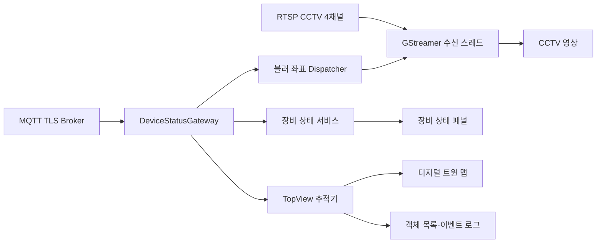

# Wise AI 주차장 디지털 트윈 관제 시스템

Qt 6와 GStreamer로 구현한 4채널 주차장 안전 관제 애플리케이션입니다. RTSP CCTV 영상, MQTT 장비 상태,
TopView 객체 좌표와 위험 이벤트를 하나의 대시보드에서 실시간으로 확인할 수 있습니다.

## 핵심 기능

- **4채널 CCTV 모니터링**: GStreamer 기반 RTSP 수신, 채널별 전용 스레드, 자동 재연결 및 로딩 상태 표시
- **실시간 디지털 트윈 맵**: MQTT TopView 좌표를 이용한 보행자·차량 위치와 이동 경로 표시
- **위험 시각화**: 객체 간 접근 위험 계산, 레이더 펄스, 위험 알림, 채널별 CCTV 경고·위험 테두리
- **개인정보 보호 블러**: MQTT 좌표와 영상 시각을 동기화해 얼굴과 차량 번호판을 선택적으로 블러 처리
- **장비 상태 모니터링**: 채널별 LED, 경광등, 부저 상태와 통신 결과 표시
- **이벤트 및 객체 목록**: 객체 진입·위험 이벤트 기록과 현재 객체 위치 목록 제공
- **표시 설정**: 맵 요소, CCTV 테두리 알림, 얼굴·차량 번호판 블러를 실행 중에 ON/OFF

## 화면 구성

대시보드는 다음 영역으로 구성됩니다.

1. 4채널 CCTV 실시간 영상
2. 디지털 트윈 주차장 맵
3. 실시간 객체 목록
4. 이벤트 로그
5. 채널별 장비 상태 패널
6. 시스템·CCTV 연결 상태와 설정 창

## 처리 구조



영상 수신기와 MQTT Gateway는 UI에서 분리되어 있습니다. 채널별 `StreamReceiver`는 각각의 `QThread`에서
동작하고, MQTT 데이터는 signal/slot과 queued connection을 통해 UI 및 영상 처리기로 전달됩니다.

## 프로젝트 구조

```text
Qt_Demo-5/
├─ assets/icons/          UI 및 디지털 트윈 아이콘
├─ include/
│  ├─ model/              스트림·객체·이벤트·장비 상태 데이터
│  ├─ network/            MQTT Gateway, 파서, 실시간 프레임 Dispatcher
│  ├─ overlays/           레이더 펄스와 위험·장비 오버레이
│  ├─ ui/                 메인 화면, 패널, 설정 대화상자
│  └─ video/              RTSP 수신 인터페이스와 블러 처리기
├─ src/                   include와 동일한 계층의 구현 파일
├─ styles/                Qt Style Sheet
├─ CMakeLists.txt
└─ CMakePresets.json
```

## 요구 사항

- Windows 10/11 64-bit
- Qt 6.11.1 MinGW 64-bit
  - Widgets
  - Network
  - MQTT
- CMake 3.25 이상 (`CMakePresets.json` 사용 시)
- Ninja
- GStreamer 1.x MinGW x86_64 개발·런타임 패키지
- C++20 지원 컴파일러

기본 GStreamer 경로는 다음과 같습니다.

```text
C:/Program Files/gstreamer/1.0/mingw_x86_64
```

다른 위치에 설치했다면 CMake의 `GSTREAMER_ROOT` 값을 변경해야 합니다.

## 빌드

### 일반 Debug 빌드

```powershell
cmake --preset debug-ninja
cmake --build --preset debug-ninja
```

### 빠른 전체 빌드

Unity Build를 사용하는 프리셋입니다.

```powershell
cmake --preset fast-debug-ninja
cmake --build --preset fast-debug-ninja
```

프리셋에는 Qt와 MinGW 경로가 포함되어 있습니다. 설치 버전 또는 경로가 다르면
`CMakePresets.json`의 `CMAKE_PREFIX_PATH`, `CMAKE_CXX_COMPILER`, `CMAKE_MAKE_PROGRAM`을 수정하십시오.

## 실행 설정

### RTSP

채널별 RTSP 주소는 `include/network/rtsp.h`에서 관리합니다. 인증 정보가 포함된 실제 주소는 공개 저장소에
커밋하지 말고, 배포 환경에서는 별도 설정 파일이나 보안 저장소로 분리하는 것을 권장합니다.

### MQTT TLS

| 환경 변수 | 기본값 | 설명 |
| --- | --- | --- |
| `VEDA_MQTT_HOST` | `100.73.128.114` | MQTT Broker 주소 |
| `VEDA_MQTT_PORT` | `8883` | TLS 포트 |
| `VEDA_MQTT_CA_FILE` | `/etc/veda/certs/ca.crt` | CA 인증서 경로 |
| `VEDA_MQTT_CLIENT_ID` | 자동 생성 | MQTT Client ID |
| `VEDA_MQTT_DEBUG` | `true` | MQTT 수신 디버그 로그 |

Windows Qt Creator에서는 **Projects > Run > Environment**에 다음과 같이 등록합니다.

```text
VEDA_MQTT_HOST=브로커주소
VEDA_MQTT_PORT=8883
VEDA_MQTT_CA_FILE=C:\certs\ca.crt
```

TLS 인증서 검증은 비활성화하지 않습니다. MQTT 세부 Topic과 Payload 규칙은
[MQTT_INTEGRATION.md](MQTT_INTEGRATION.md)를 참고하십시오.

### 선택 환경 변수

| 환경 변수 | 설명 |
| --- | --- |
| `QTCCTV_DECODER_MODE` | GStreamer 디코더 선택 모드 |
| `QTCCTV_BLUR_SYNC_OFFSET_MS` | 영상과 MQTT 블러 좌표의 동기화 보정값(ms) |
| `VEDA_MAP_MIN_X`, `VEDA_MAP_MIN_Y` | TopView 맵 좌표 최솟값 |
| `VEDA_MAP_MAX_X`, `VEDA_MAP_MAX_Y` | TopView 맵 좌표 최댓값 |

## 주요 MQTT 데이터

애플리케이션은 MQTT 데이터를 발행하지 않고 구독하여 화면에 반영합니다.

| Topic | 용도 |
| --- | --- |
| `veda/hw/+/status` | 채널별 장비 피드백 |
| `veda/hw/status` | 중앙 장비 상태 |
| `veda/ch/+/alive` | 채널 health/LWT |
| `veda/ch/+/topview` | 직접 TopView 객체 좌표 |
| `veda/qt/ch/+/topview` | 중계된 TopView 객체 좌표 |
| `veda/qt/event` | 중앙 위험 이벤트 |
| `veda/ch/+/blur` | 얼굴·차량 번호판 블러 영역 |

## 개발 원칙

- UI, 네트워크, 영상, 오버레이, 모델 계층의 역할을 분리합니다.
- UI 객체는 GUI 스레드에서만 갱신합니다.
- 영상 채널은 각각 독립된 수신 스레드에서 실행합니다.
- 외부 Payload는 파서에서 검증한 뒤 내부 모델로 변환합니다.
- 새 수신 구현은 `StreamReceiver`, 새 장비 통신 구현은 `DeviceStatusGateway` 인터페이스를 구현합니다.
- 코드는 `.clang-format`, `.clang-tidy`, `C_CppCodingConvention.md` 규칙을 따릅니다.

## 문제 해결

### Qt MQTT 모듈을 찾지 못하는 경우

Qt Maintenance Tool에서 현재 Kit와 같은 버전·컴파일러의 `Qt MQTT` 모듈을 설치한 뒤 CMake를 다시 구성합니다.

### GStreamer DLL 또는 플러그인을 찾지 못하는 경우

Qt Kit와 GStreamer가 모두 MinGW x86_64인지 확인하고 GStreamer의 `bin` 경로를 실행 환경의 `PATH`에 추가합니다.

### MQTT 연결 오류가 발생하는 경우

Broker의 IP·포트, 방화벽, CA 인증서 경로를 확인합니다.

```powershell
Test-NetConnection $env:VEDA_MQTT_HOST -Port $env:VEDA_MQTT_PORT
Test-Path $env:VEDA_MQTT_CA_FILE
```

## 관련 문서

- [MQTT 통합 명세](MQTT_INTEGRATION.md)
- [C/C++ 코딩 컨벤션](C_CppCodingConvention.md)
